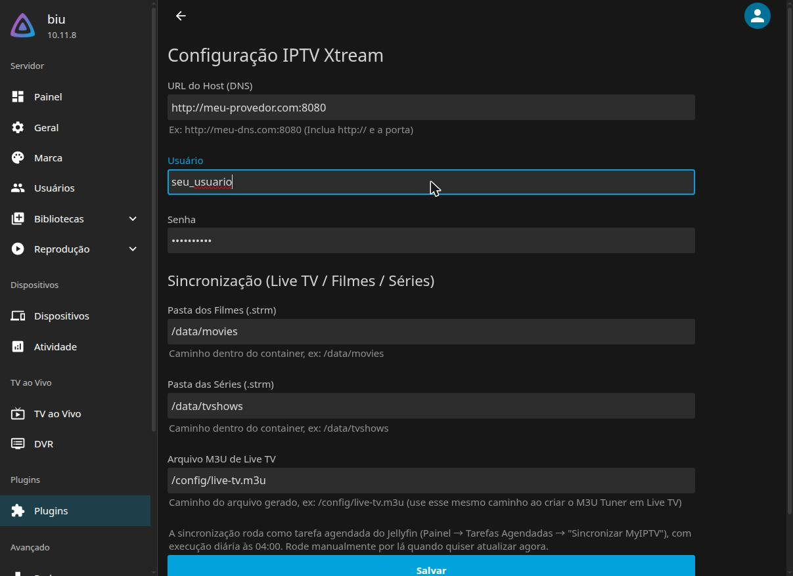

# Jellyfin Plugin: MyIPTV

[🇧🇷 Português](README.md) | 🇺🇸 English

A Jellyfin plugin that syncs an **Xtream Codes** (IPTV) provider with your library:
it automatically generates a Live TV M3U playlist (with categories and EPG) and
`.strm` files for Movies and Series, ready for Jellyfin to scan as regular libraries.

## Disclaimer

This project is a technical synchronization tool: it reads the catalog of an Xtream
Codes provider **you already have access to** and organizes that data inside your own
Jellyfin instance (M3U playlist, EPG guide, `.strm` files). We do not provide, host,
resell, or have any affiliation with IPTV providers.

IPTV services are sometimes associated with unauthorized distribution of copyrighted
content. Responsibility for the legality of the chosen provider and the content
accessed rests entirely with the user. Use at your own risk, and only with services
you are legally entitled to access.

## Why this, instead of a "channel" inside Jellyfin?

Older IPTV plugins for Jellyfin typically implement the `IChannel` interface (the old
"Channels" tab). Starting with Jellyfin 10.9+, that third-party extension point stopped
being used by the core — `IChannel` still loads fine, but is never instantiated by the
`ApplicationHost`, so no content ever shows up. Tested and confirmed on 10.11.8.

This plugin instead uses **`IScheduledTask`** (which still works normally) to generate
the files Jellyfin already knows how to consume natively: an M3U Tuner + XMLTV for Live
TV, and regular media libraries for Movies/Series via `.strm`.

## Requirements

- Jellyfin **10.11.x** (net9.0). Not tested on other major versions.
- An Xtream Codes provider (host, username, password).
- Folders writable by the user running Jellyfin (e.g. PUID 1000 on
  `linuxserver/jellyfin` images) for where the `.strm` files will be written.

## Installation

### Via plugin repository (recommended)

1. In Jellyfin: **Dashboard → Plugins → Repositories → Add Repository**.
2. URL: `https://raw.githubusercontent.com/rhuancampos/MyIPTV-Jellyfin/main/manifest.json`
3. Go to **Catalog**, find "Meu IPTV Custom", and install it.
4. Restart Jellyfin.

### Manual

1. Download the `.dll` from the [latest release](https://github.com/rhuancampos/MyIPTV-Jellyfin/releases).
2. Copy it to `<config>/data/plugins/Jellyfin.Plugin.MyIPTV_<version>/`.
3. Restart Jellyfin.

## Configuration

> The plugin's configuration screen and log messages are currently in Portuguese only.
> Field labels are listed below for reference.

Dashboard → Plugins → **Meu IPTV Custom**:



| Field | Description |
|---|---|
| M3U playlist link | *Optional.* Your provider's `get.php?...&type=m3u_plus&output=ts` link. If set, the sync uses only this (see below) |
| Host | Your Xtream panel URL, including `http://` and the port |
| Username / Password | Your Xtream subscription credentials (not needed when using the playlist link) |
| Movies Folder | Where movie `.strm` files are written (default `/data/movies`) |
| Series Folder | Where series `.strm` files are written (default `/data/tvshows`) |
| M3U File | Where `live-tv.m3u` is written (default `/config/live-tv.m3u`) |

**Important:** the Movies/Series folders must be writable by the Jellyfin process user.
On `linuxserver/jellyfin` images, that usually means running once:
```bash
docker exec -u root <container> chown -R abc:abc /data/movies /data/tvshows
```

## Running the sync

Dashboard → **Scheduled Tasks** → "Meu IPTV Custom" category → **Sincronizar MyIPTV** →
run it manually the first time. After that, it runs on its own every day at 04:00.

There are two data sources; pick one:

- **Xtream API** (Host + Username + Password): fetches categories and channels, matches them
  against the XMLTV guide, fetches the movie catalog and, for each series, one
  `get_series_info` call (slow on large catalogs, and some providers rate-limit with 503).
- **M3U playlist link** (`type=m3u_plus`): downloads everything in a **single request**,
  already including categories, guide `tvg-id` and every episode. Much faster and immune to
  rate limits. The link's `output` parameter (`ts` or `m3u8`) sets the live channel format.
  Episodes are recognized by `SxxExx` in the name (e.g. `Os Flintstones S01E09`).

Either way the result is the same: the Live TV M3U plus one `.strm` per movie and per episode.
If a stage fails (e.g. provider down), existing files are kept and the task ends as failed.

## How files are organized

```
/config/live-tv.m3u                                     ← a single M3U with every channel
/data/movies/Drama/Captain Marvel (2019)/Captain Marvel (2019).strm
/data/tvshows/Netflix/The Flintstones/Season 01/The Flintstones - S01E09.strm
```

- **A category becomes a folder**, without the prefix before the `|` (`Filmes | Drama` →
  `Drama`, `Series | Netflix` → `Netflix`). In the M3U, the channel's `group-title` follows
  the same rule (`Canais | Globo` → `Globo`), and a channel name repeating its category is
  shortened (category `A Fazenda 18` + channel `A Fazenda 18 CAM 01 (A)` → `CAM 01 (A)`).
- **Names are cleaned so Jellyfin finds metadata**: tags like `[L]` and `[4K]` are dropped,
  `Name - 2009` becomes `Name (2009)`, and `:` becomes `-` (`Alabama: Presos` → `Alabama - Presos`).
- **No duplicates**: a movie or series present in more than one category (or more than one
  version, such as `[L]` and `[4K]`) is written once, in the first category it appears in.
  Subtitled (`[L]`) versions are only used when there is no other.
- **Guide (EPG)**: uses the `tvg-id`/`epg_channel_id` the provider reports; without it, matches
  by channel name ignoring `HD`, `FHD`, `4K`, `H265`, etc.
- Files are only rewritten when their content changes. The plugin **never deletes** anything:
  if a title leaves the provider, the old `.strm` stays until you remove it.

## After syncing

- **Live TV**: Dashboard → Live TV → Tuner Devices → add an M3U Tuner pointing to the
  configured file. Then, TV Guide Data Providers → XMLTV → your provider's guide URL.
- **Movies/Series**: create regular libraries pointing at the configured folders, with
  the correct content type (Movies / Shows), and run a scan.

## License

GPL-3.0 — see [LICENSE](LICENSE).
